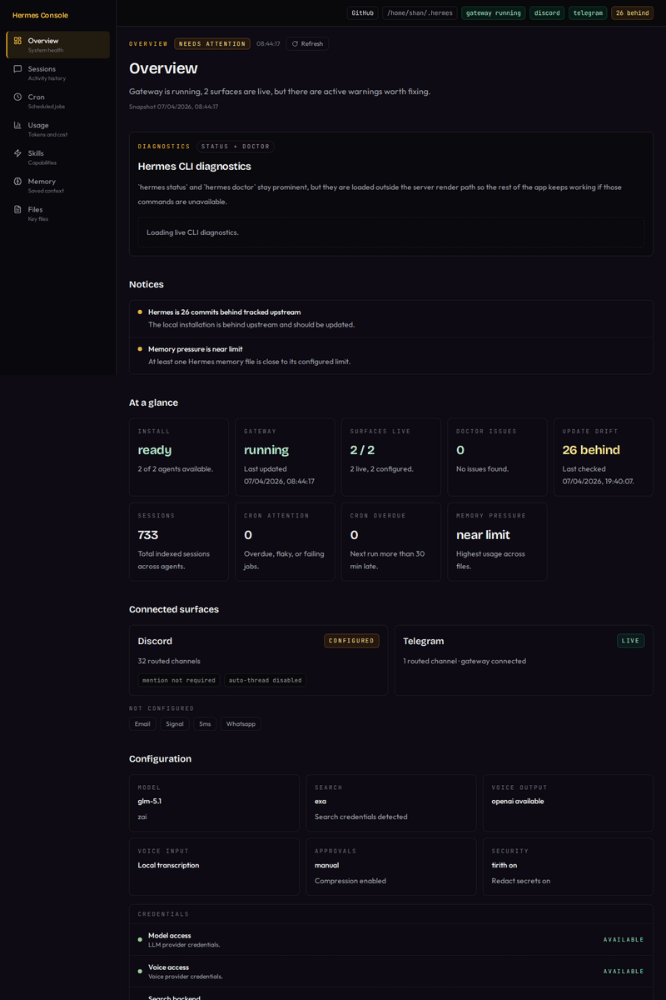
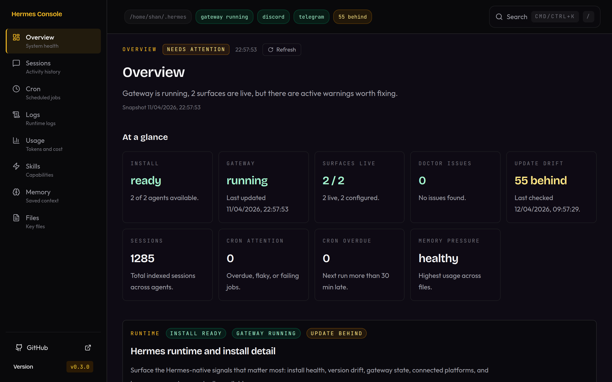
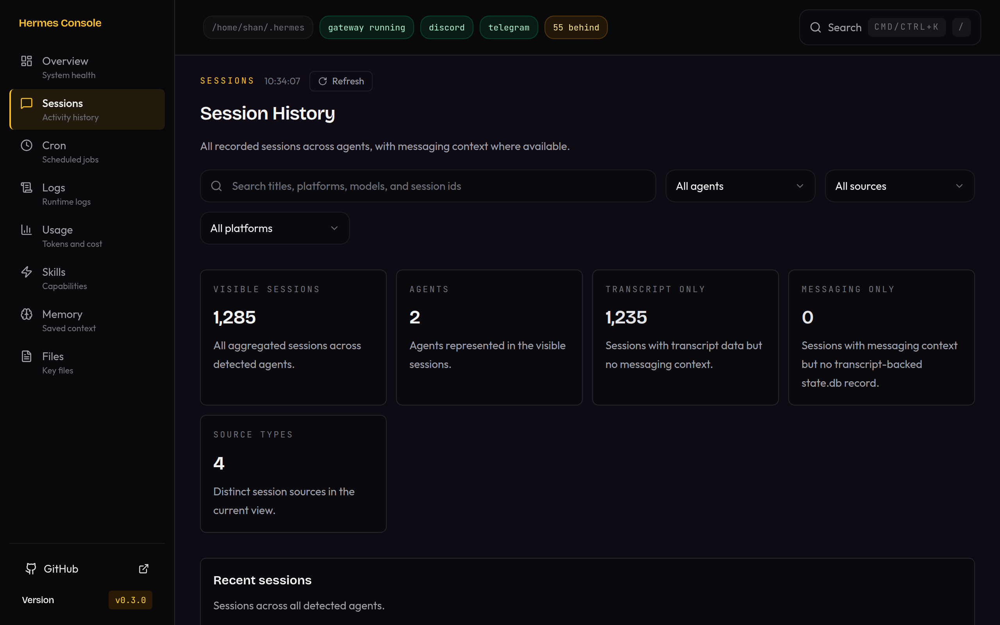
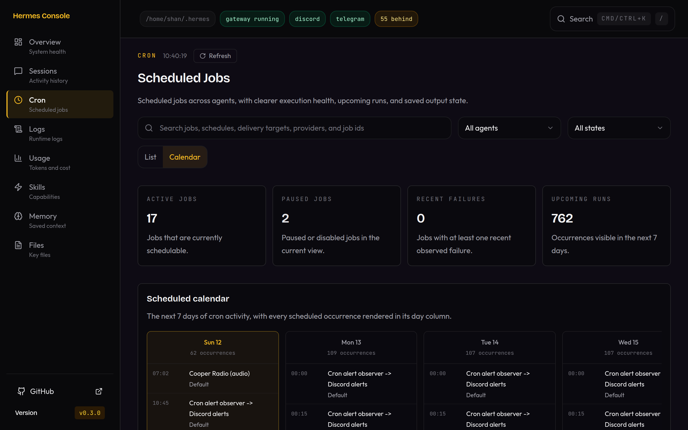
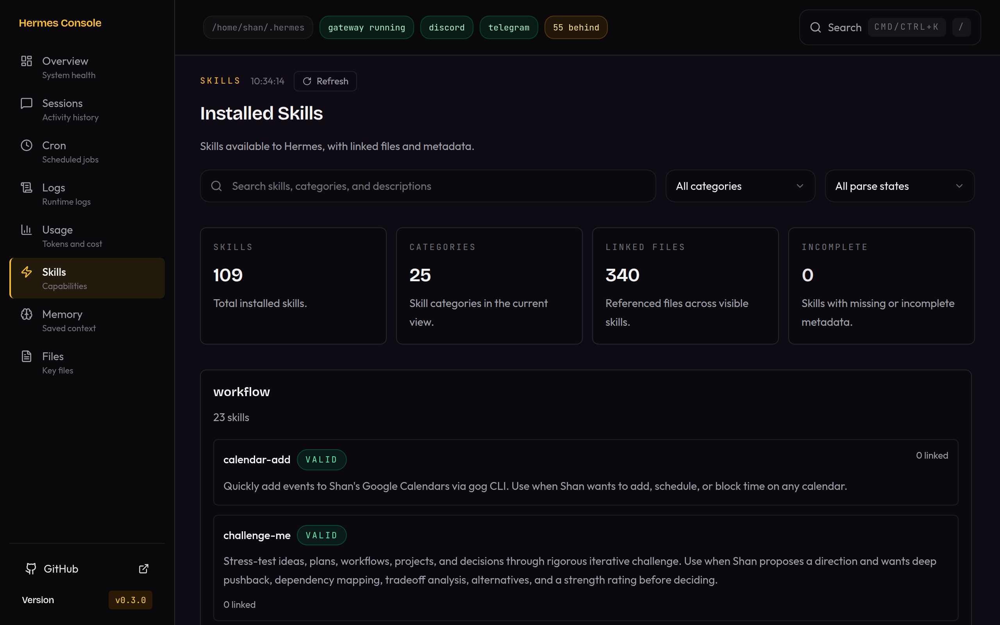
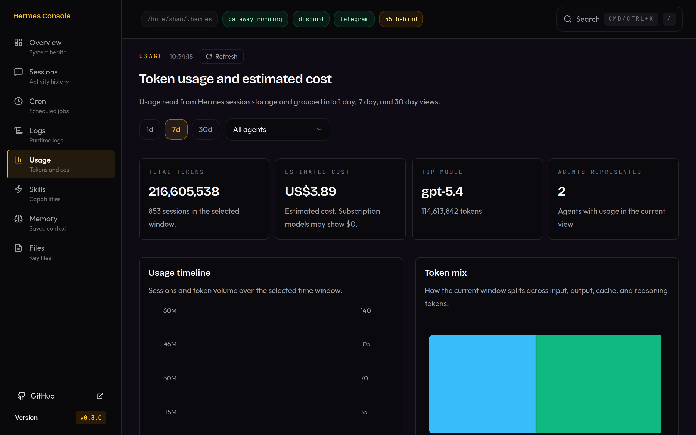
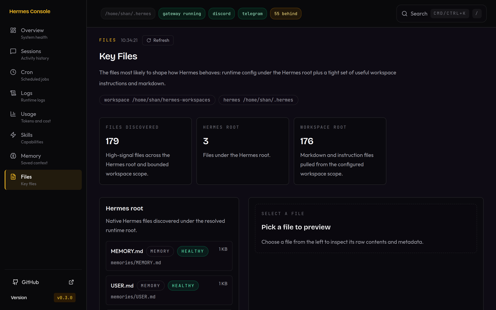
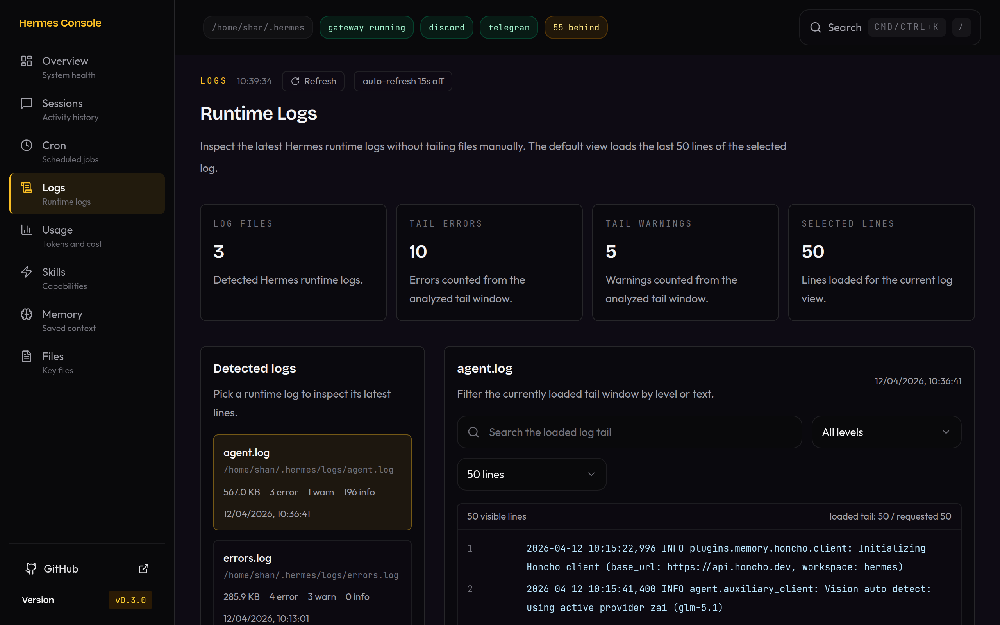

<div align="center">

# Hermes Console

**A local-first dashboard for your Hermes Agent setup.**

Point it at `~/.hermes`. See what's running, what's scheduled, what's stored, and what needs attention.

[](./apps/web/public/readme/hermes-console-tour.gif)

</div>

---

## What it is

A read-only web UI that inspects your local Hermes state directly from disk. No cloud, no auth, no external services — just your files and a browser.

**Surfaces:**

- **Overview** — runtime health, gateway state, connected platforms, warnings, update drift
- **Sessions** — recent Hermes runs across agents with filtering and search
- **Cron** — scheduled job status, calendar view, observed run health, recent outputs
- **Skills** — installed skills, categories, linked files, detail views
- **Memory** — `MEMORY.md` / `USER.md` visibility with pressure indicators
- **Config** — per-agent `config.yaml` inspection with readable missing/unreadable states
- **Files** — high-signal config and instruction file previews
- **Usage** — token counts, estimated cost breakdowns, and trend charts
- **Logs** — bounded runtime log tails with search, level filtering, and opt-in auto-refresh

## What it isn't

- Not a chat client
- Not a terminal replacement
- Not a hosted SaaS
- Not a generic multi-agent platform

## Why use it

If you run Hermes locally and want to understand your setup without digging through files and CLI output — this does that. One screen, live data, calm UX, no theatre.

Recent polish in `v0.4.0`:

- a new Config page for inspecting `config.yaml` across root and profile agents
- stronger runtime/install detail on Overview, including clearer Hermes CLI version visibility
- a proper GitHub Actions CI gate for PRs and pushes to `main`
- expanded config/runtime test coverage to keep the new read surfaces honest

## Running Hermes Console

Hermes Console has two normal ways to run:

- `pnpm dev` for local development with Vite and the local API
- `pnpm build && pnpm start` for a built local app served by the API

The API intentionally binds to `127.0.0.1`. Hermes Console is local-only by default, not a LAN-hosted dashboard.

Agent discovery comes from the configured Hermes root. If you have multiple Hermes profiles under `~/.hermes/profiles`, Hermes Console will pick those up automatically from `HERMES_CONSOLE_HERMES_DIR` or the default `~/.hermes`.

## Quick start

Use Node `20.19+` and the repo's pinned `pnpm` version.

```bash
git clone https://github.com/shan8851/hermes-console.git
cd hermes-console
pnpm install
cp .env.example .env.local
pnpm dev
```

Open `http://localhost:5173`.

If you want the Files view to include project-level instruction and context files, set a workspace root in `.env.local`:

```bash
HERMES_CONSOLE_WORKSPACE_DIR=/absolute/path/to/your/workspace
```

That opt-in scan is what lets Hermes Console pick up bounded workspace files like `AGENTS.md`, `README.md`, and similar markdown or instruction docs outside `~/.hermes`.

This workspace root is for project file discovery, not agent discovery. Multi-agent views come from the Hermes root itself, especially `~/.hermes/profiles`.

What that does:

- starts the runtime package in watch mode
- starts the local API on the configured `PORT`
- starts the Vite web app and proxies `/api` to that local API

For a built local run:

```bash
pnpm build && pnpm start
```

That serves the built web app and API together from the configured `PORT`, usually `http://127.0.0.1:3940`.

## Configuration

Copy `.env.example` to `.env.local` and adjust as needed.

| Variable                       | Default     | Description                                                |
| ------------------------------ | ----------- | ---------------------------------------------------------- |
| `HERMES_CONSOLE_HERMES_DIR`    | `~/.hermes` | Hermes state root                                          |
| `HERMES_CONSOLE_WORKSPACE_DIR` | unset       | Optional workspace root for bounded project file discovery |
| `HERMES_CONSOLE_HERMES_BIN`    | `hermes`    | Hermes CLI path override                                   |
| `PORT`                         | `3940`      | API port                                                   |

The defaults assume a standard local Hermes setup under `~/.hermes`.
Set `HERMES_CONSOLE_WORKSPACE_DIR` if you want the Files view to include high-signal project docs outside the Hermes root.

## Remote access

Hermes Console does not ship with built-in auth and does not listen on your LAN by default.

If you want to reach it from another machine, expose it intentionally through something you control, such as:

- a Tailscale serve/proxy setup
- an SSH tunnel
- an authenticated reverse proxy on your local network

Do not expose Hermes Console directly to the public internet without putting proper access control in front of it.

## Screenshots

<p align="center">
  
  
</p>
<p align="center">
  
  
</p>
<p align="center">
  
  
</p>
<p align="center">
  
</p>

## Release workflow

Hermes Console uses repo-wide versions and git tags for public OSS releases.
PRs to `main` also run GitHub Actions checks for formatting, linting, typechecking, tests, and build on Node `20.19+`, so `pnpm release:check` is the local mirror of the same gate.

```bash
pnpm release:check
git commit -m "chore(release): prepare v0.4.0"
git tag v0.4.0
```

After that, push `main` and tags, then create the matching GitHub release from the `CHANGELOG.md` notes.

## Contributing

Found a bug? Have a feature idea? Open an issue or PR. Feedback welcome.
Before opening a PR, run `pnpm release:check` locally so the same formatting, lint, type, test, and build checks are already green.

## License

MIT
